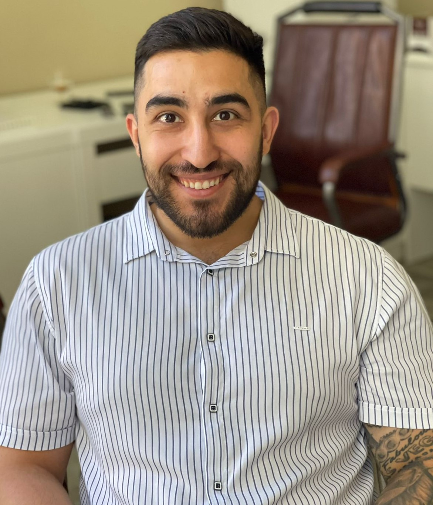

#Frontend-разработчик (Обучаюсь)#

Добрый день. Начинающий Frontend-разработчик, в процессе обучения. Уже изучил:
- HTML - верстка ;
- Адаптивная и мобильная вертска;
-Основы Javascript;
Имею минимальный опыт и максимальное желание реализовать ваш проект. В качестве практики .

